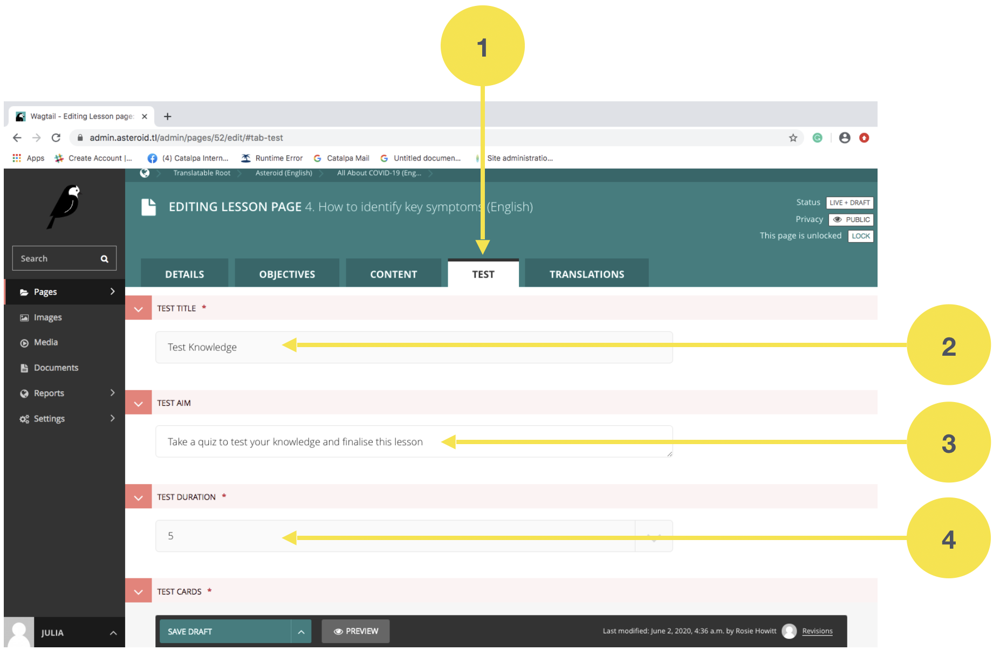
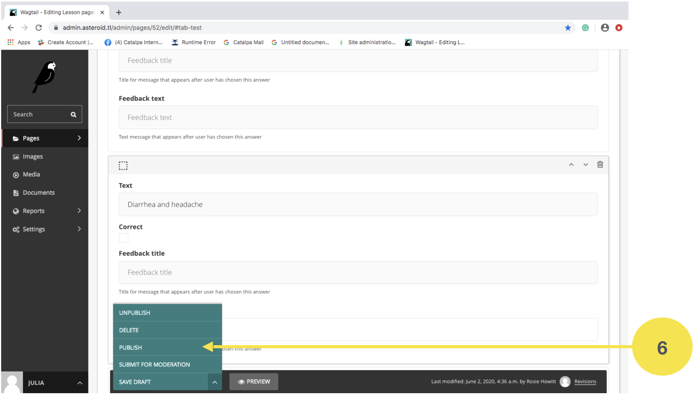

Kria resposta ba Teste
-----------------------

Depois kria ka tau konteúdu, admin mos presiza atu tau pergunta inklui resposta iha parte Teste ka Test, hanesan etapa tuir mai: 

1. Ba iha parte “TEST” iha kada konteúdu

2. Iha parte “TEST TITLE”, bele hakerek “Test Knowledge” 

3. Iha parte “TEST AIM”, bele hakerek “Take a quiz to test your knowledge and finalise this lesson”

4. Iha parte “TEST DURATION”, bele hili durasaun atu halo teste ida ne’e. Ezemplu bele hili  “5’ minutu. 

5. Iha parte “TEST CARDS”, 

    a. Hakerek pergunta iha parte “Question”
    b. Hakerek resposta iha parte “Answers”.
    c. Karik resposta ida ne’e mak sai hanesan resposta los ka koretu, nune’e presiza tau sinal ‘tik’ iha parte “Correct” nia okos.

Karik resposta ida ne’e laos resposta ne’ebé los entaun la presiza tau sinal ‘tik’.

.. Important::
    Bainhira iha pergunta ida mak la iha resposta ne’ebé los, ka la tau sinal ‘tik’ iha resposta ida, entaun automatikamente ita sei la bele salve ka ‘save’, no labele publika ka ‘publish’ konteúdu ida ne’e. 

.. image:: _static/images/image10.png

6. Keta haluha “Save Draft” ka “Publish”, atu rai ka publika konteúdu bainhira kria hotu ona.

