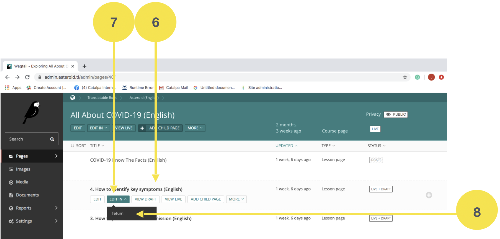

Tradusaun ba lian
------------------

Atu tau konteúdu ho lian Tetum ka Ingles, ita sei halo hanesan etapa tuir mai: 

1. Ba iha `Haroman Admin <https://admin.haroman.tl/>`_

2. Klik iha “Pages”

.. image:: _static/images/image1.png

3. Klik iha rama iha parte “Translatable Roots”.

4. Klik iha rama iha parte “Asteroid (English)”, bainhira ita iha ona konteúdu Ingles no hakarak traduz ba lian Tetun.

5. Klik iha konteúdu ida. Ezemplu “All about Covid-19 (English)”. 

.. image:: _static/images/image4.png

6. Tau kursor iha konteúdu ida. Ezemplu “How to identify key symptoms (English)”.

7. Klik iha rama iha liafuan “Edit In”

8. Klik iha “Tetum”

9. Ida ne’e sei lori direitamente ba lisaun konteúdu ne’ebé hanesan iha lian Tetum no ita bele hahu halo tradusaun ba konteúdu iha neba.

.. image:: _static/images/image6.png

10. Karik durante tradusaun, ita hakarak ba fali konteúdu lian Ingles nian:

    a. Klik iha parte “TRANSLATIONS” 

    b. Iha parte Canonical Page, klik liman-loos (right-clicked) iha títulu konteúdu nian

    c. Klik iha “Open Link iha New Tab”, hodi versaun Inglés bele mosu iha pájina seluk no sei hafasil atu haree bainhira halo tradusaun.

11. Keta haluha “Save Draft” ka “Publish”, atu rai ka publika konteúdu bainhira halo tradusaun hotu ona.

.. image:: _static/images/image8.png
